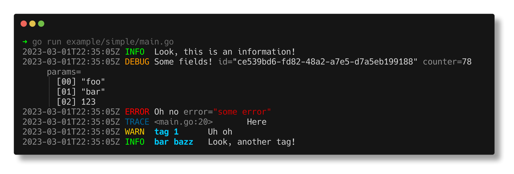

# rogu

ログ (*rogu*, jap. *log*) is *yet another* taggable, human readable, colorful, structured logging package with a builder-like API. This package is mainly created to be used within [shinpuru](https://github.com/zekrotja/shinpuru) and other projects of mine. Feel free to use it too, but beware that this package is not optimized for performance.

> **Warning**  
> Just wanna let you know, the API of this package is not yet final and might change in coming updates.

This package is very much inspired by the colored output style of [charmbracelet/log](https://github.com/charmbracelet/log) and the builder API style of [rs/zerolog](https://github.com/rs/zerolog).

## Levels

Log levels can be set to a [`Logger`](https://pkg.go.dev/github.com/zekrotja/rogu#Logger) via the `SetLevel` method. `Level`s are defined in the sub-package [`level`](https://pkg.go.dev/github.com/zekrotja/rogu/level#Level). Levels can be interpreted from a string using the function [`LevelFromString`](https://pkg.go.dev/github.com/zekrotja/rogu/level#Level). Below, you can see available levels with their numeral values, names and aliases. The given names and aliases are valid values which can be passed to `LevelFromString`.

| Level | Numeral Value | Name and aliases |
|-------|---------------|------------------|
| `Panic` | `1` | `"panic"`, `"pnc"`, `"p"`, `"1"` |
| `Fatal` | `2` | `"fatal"`, `"ftl"`, `"f"`, `"2"` |
| `Error` | `3` | `"error"`, `"err"`, `"e"`, `"3"` |
| `Warn`  | `4` | `"warn"`, `"wrn"`, `"w"`, `"4"` |
| `Info`  | `5` | `"info"`, `"inf"`, `"i"`, `"5"` |
| `Debug` | `6` | `"debug"`, `"dbg"`, `"f"`, `"6"` |
| `Trace` | `7` | `"trace"`, `"trc"`, `"t"`, `"7"` |